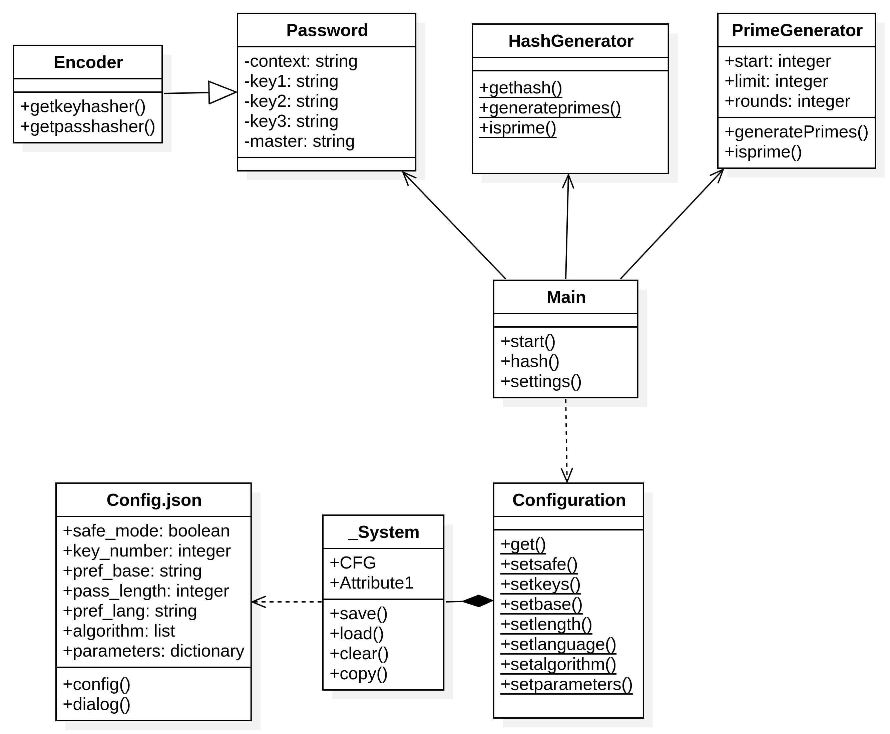
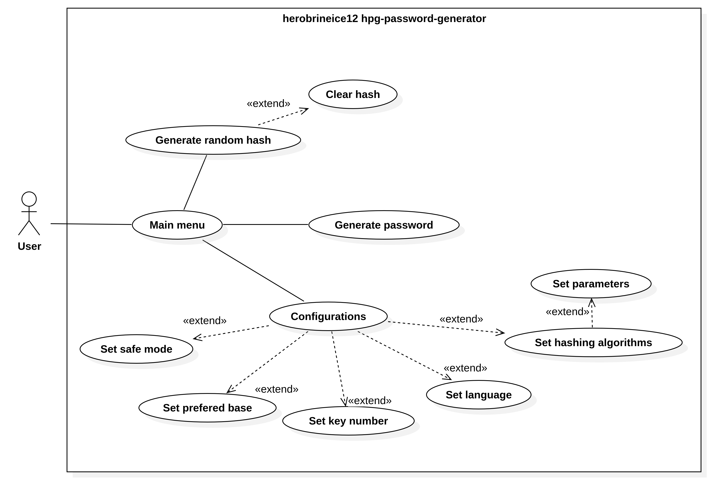

# HPG Password Generator

For the portuguese version of this README, 

## Definition

**HPG Password Generator** (HPG is a redundant acronym for ”Herobrineice12’s Password Generator”) is a user first, no storage, offline, portable python script made with the intention of generating passwords with cryptographic level of security, every password you generate on it can be reproduced with the same exact keys you desire for. The principal purpose of this application is to give the user all the control he wants over his passwords.

It also can be installed as console application script, so you can integrate it with your operational system, that unlock possibilities like running it with a keyboard shortcut or with a executable application.

## Features

- Completely offline.
- No password storing for better security.
- Reproducible password generation with 5 keys (1 Context, 3 Keys, 1 Master password).
- Option for choosing how many keys you wanna use for the password.
- Random hash generation with a message key and prime numbers generator.
- Persistent configurations.
- Language options (English, Portuguese).
- Different decoding base options (Base 85, 64, 64-URL, 16).
- Option to hide your inputs with safe mode.
- Capability of limiting the length of your password.
- Automatic copying mechanism for clipboard.
- Possibility to change how the algorithms interact
- Capability to edit the current algorithm parameters

## How it works

This script achieves it’s functionality by using a combination of well known algorithms on the security industry such as Argon2 and Blake2b for key and password derivation. Let me tell you how this script does it.

### Password generator

Firstly the app will ask you for a **context**, that means, where the password will be used. This input will be then encoded into a byte array and used as a salt for the intermediary keys. I personally recommend using the name of application, service or site you’re using.

Secondly it will ask you for the **intermediary keys**. theses keys are used to create a supersalt, which will be used in the derivation of the master key, there is no restrictions of what the keys should be, leaving that for the user.

And finally, it will ask you for the **master key**. This is the most important input, because it’s the last one to be encoded and used on the algorithm, i recommend you to use the most complicated input you can write in this field for better security. This piece can also be substituted by a completely random hash generated by the hash generator.

### Hash generator

The **hash generator** is generator who uses prime number calculations for creating a random key. When you use it, it will firstly ask you for a number (of bits) of possible calculations to be done by the algorithm, then it will ask you for a optional message to be used in the hash derivation. The result will not be show after calculating, but it will be displayed after generating a password

## History

This project born to resolve a problem that I myself found stuck with, that is, a way to create complex reproducible passwords without the need for storing the output on a online service or a offline device, leaning only in the user capability of remembering his own keys.

This project was firstly posted in the date of July 10 of 2025, and so on, it was reformulated 2 times, your second, never released version was compatible with the first one released, but it was later deprecated in this third release in favor of better code architecture and modularity.

This version also adds the possibility for the user to edit the used KDFs (Key Derivation Functions) and its parameters for more flexible security and time cost options.

### Planning process

The planning process of re-factorization was inspired by UML diagrams that I made. I did a class and a use case diagram for a general view of the project’s architecture, as shown bellow:



Classes diagram



Use case diagram

## Dependencies

In order to use this password generator, you’re going to need some dependencies for its functionality:

- python3 interpreter
- cffi python module
- argon2-cffi python module
- pyperclip python module
- xclip program (Only if you are on Linux)
- termux-api package (Only if you are on Android)
- pyinstaller module/program (If you want to compile it to a executable application)

You can install python by searching for it and downloading via your web browser, package manager, or application store. A example of a package manager installation is:

```bash
sudo pacman -S python3
```

To install python modules you will need to use pip, which is a python package manager for installing modules that aren’t builtin in the language. Here is a example of pip installations:

```bash
pip install cffi argon2-cffi pyperclip pyinstaller
```

However, in systems like Arch Linux this command can be pretty dangerous because the system may use older versions of python modules, that means that by doing this you could break your operational system. So if you’re using a Arch Linux based distro, please use pacman to install python modules.

```bash
sudo pacman -S python-cffi python-argon2-cffi python-pyperclip pyinstaller
```

## Usage

You can start the script by running the `Main.py` file and it will show you a menu of options for selection, it will be starting first in english, i tried to make it as self explanatory as possible for use, so i’m open to feedback if you found something i could change.

As said in the definition, it also can be compiled into a executable application for better integration with your system, may it be for automation, fast access on the programs menu or for launching with a keyboard shortcut, you choose!

To compile, follow these instructions:

1. Install pyinstaller with pip or package manager
2. Go to the project folder using the terminal
3. Use the command below to initiate the compile process

```bash
pyinstaller passgen.spec
```

Done! your app will be available in the `dist/` folder for usage.
